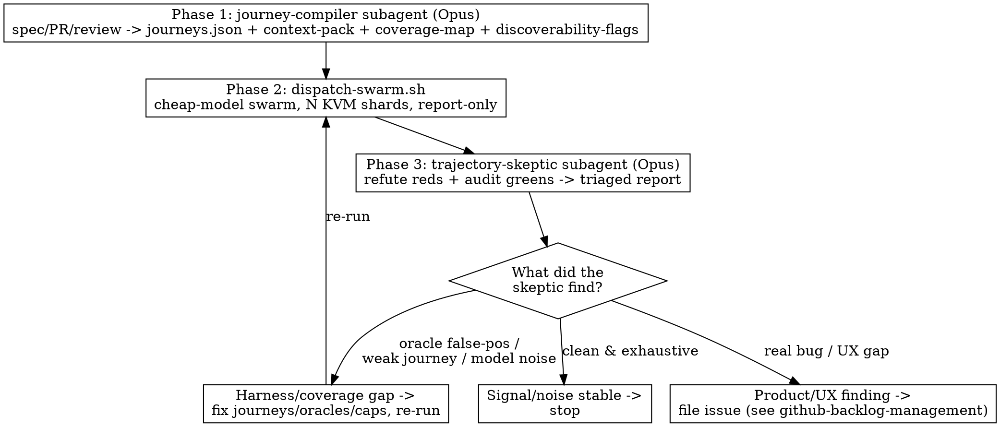

# LLM Dogfooding — spec-anchored exploratory testing

## Overview

Drive a cheap-model **swarm** to use a feature like a real user, gate every
action with **deterministic oracles** ("LLM proposes, harness disposes"), and
**adversarially triage** the results with a strong model. It catches the class
deterministic tests miss: *the product is wired correctly but is wrong, awkward,
or undiscoverable to actually use.*

Three ideas make it work — internalize them before running:

1. **Fair-test boundary (no cheating).** The swarm gets ONLY what a user has —
   README + `--help` + published docs. NOT the spec or source. If the swarm
   can't figure out how to use a feature, that's a **finding** (the product isn't
   self-explanatory; humans will struggle too) — not a reason to help it.
2. **Bidirectional skepticism.** A red trajectory is innocent until proven a bug.
   A green trajectory is unproven until shown the swarm reached the goal
   *honestly, through the feature* — not by cheating, an unverified claim, or a
   premature "done".
3. **The loop.** Each run yields product findings AND harness/coverage gaps.
   Improve and re-run until signal/noise stabilizes.

## When to use

- A feature just merged and you have its spec + PR; you want the "use it as
  intended" pass a human would do, at swarm scale and breadth.
- You suspect an LLM-authored feature has obvious-in-use flaws deterministic
  tests won't show.
- **Not** for: pure unit/property/fuzz/mutation coverage (already deterministic);
  perf benchmarking; anything without a spec to anchor expectations.

## Process (subagent-driven — keep the orchestrator lean)

- **Phase 1** — dispatch the `journey-compiler` subagent. It reads the privileged
  anchors and emits `journeys.json` + the fair-test `context-pack.md` + a
  coverage map + predicted discoverability flags. (Optionally run
  `scripts/gather-context-pack.sh` first to assemble the user-visible surface.)
- **Phase 2** — `scripts/dispatch-swarm.sh <feature> <journeys.json> <shards> <max_usd>`:
  validates the journeys, pushes a `dogfood-run/<feature>` branch off `origin/main`
  (NO PR), triggers `dogfood.yml`, watches, and downloads the trajectory bundles.
  Report-only: a run that finds bugs still exits 0.
- **Phase 3** — `scripts/collect-trajectories.py <artifacts-dir>` to flatten, then
  dispatch the `trajectory-skeptic` subagent over the bundles + anchors. It
  returns a triaged report: confirmed findings, rejected candidates, a
  positive-trajectory audit, and harness/coverage recommendations.

Keep only the distilled outputs (journey count, the triaged report) in the
orchestrator's context — the bundles and reasoning live in the subagents.

## The fair-test boundary (do not violate)

| Party | Knows | Role |
|---|---|---|
| `journey-compiler` (Opus) | spec + PR + review + source | derive journeys + citable expects |
| **swarm** (cheap, in CI) | **README + `--help` + docs only** | use the product as a user |
| `trajectory-skeptic` (Opus) | spec + PR + review | judge against ground truth |

Privileged knowledge is laundered OUT of everything the swarm sees: journey
`intent` is a user goal in user language, `expect` is user-observable, and the
context pack contains no spec/source. Helping the swarm past a usage gap destroys
the test's main signal.

## Quick reference

| Need | Use |
|---|---|
| Build the fair-test context pack | `scripts/gather-context-pack.sh <bin> <repo-root>` |
| Dispatch + watch + download the swarm | `scripts/dispatch-swarm.sh <feature> <journeys.json> <shards> <max_usd>` |
| Flatten bundles for the skeptic | `scripts/collect-trajectories.py <artifacts-dir>` |
| Journey / trajectory file contracts | `hack/dogfood/schema/*.schema.json` |
| Phase-2 runner internals & oracle harness | `hack/dogfood/` (`run_journeys.py`, `oracles.py`, `local-harness.md`) |
| Why & deeper method | [references/methodology.md](references/methodology.md) |

## Common mistakes

- **Leaking the spec to the swarm** (in the context pack, or by writing exact
  commands into journeys "so it won't struggle") — kills discoverability signal.
- **Trusting green** — a passing journey that never reached its assertion verifies
  nothing. The skeptic must audit positives, not just reds.
- **Thin anchors** — an `expect` you can't cite is slop; the oracle can't judge it.
- **Opening a PR for the `dogfood-run/*` branch** — fires the normal gates; push
  only, dispatch only.
- **Confusing swarm weakness with product bugs** — the cheap model guesses bad
  values/names and botches shell quoting. That's self-inflicted *unless* the
  fumble is the product being unusable from `--help` alone (then it's a UX
  finding). The skeptic disentangles.
- **Omitting caps** — `--max-turns`/`--step-cap`/`--max-usd`/`--action-timeout`/
  loop-dedup are mandatory; a runaway swarm burns the budget.

See [references/methodology.md](references/methodology.md) for the oracle catalog,
the candidate/cheating taxonomies, field gotchas (short socket paths, harness
code in the product repo), and the signal/noise maturation signal.
