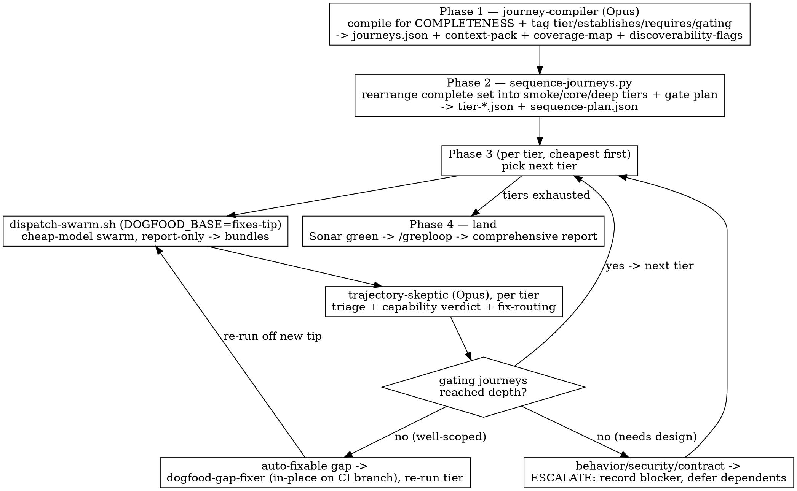

# LLM Dogfooding — spec-anchored exploratory testing

## Overview

Drive a cheap-model **swarm** to use a feature like a real user, gate every
action with **deterministic oracles** ("LLM proposes, harness disposes"), and
**adversarially triage** the results with a strong model. It catches the class
deterministic tests miss: *the product is wired correctly but is wrong, awkward,
or undiscoverable to actually use.*

Three ideas make it work — internalize them before running:

1. **Fair-test boundary (no cheating).** The swarm gets ONLY what a user has —
   README + `--help` + published docs. NOT the spec or source. If the swarm
   can't figure out how to use a feature, that's a **finding** (the product isn't
   self-explanatory; humans will struggle too) — not a reason to help it.
2. **Bidirectional skepticism.** A red trajectory is innocent until proven a bug.
   A green trajectory is unproven until shown the swarm reached the goal
   *honestly, through the feature* — not by cheating, an unverified claim, or a
   premature "done".
3. **The progressive, self-improving loop.** Don't fire 50 deep journeys to learn
   the README lacks a basic. Compile for completeness, then run **shallow tiers
   first** (smoke → core → deep), gating deeper tiers on the capabilities the
   earlier ones establish. Between tiers, **fix well-scoped gaps in-place** on the
   CI branch (docs, `--help`, error wording, the harness) so the next tier goes
   deeper instead of re-stumbling — and **escalate** anything touching behavior,
   security, or a contract. Each run yields product findings AND harness gaps;
   iterate until signal/noise stabilizes.

## When to use

- A feature just merged and you have its spec + PR; you want the "use it as
  intended" pass a human would do, at swarm scale and breadth.
- You suspect an LLM-authored feature has obvious-in-use flaws deterministic
  tests won't show.
- **Not** for: pure unit/property/fuzz/mutation coverage (already deterministic);
  perf benchmarking; anything without a spec to anchor expectations.

## Process (subagent-driven — keep the orchestrator lean)

Four phases. Phase 3 is a **per-tier loop** that dispatches cheapest-first, fixes
well-scoped gaps in-place, and gates depth on capability. Full mechanics (tiers,
the gate, the auto-fix boundary, CI hygiene, the report) are in
[references/methodology.md](references/methodology.md) — read it before a run.

- **Phase 1 — Compile (completeness).** Dispatch `journey-compiler`. It reads the
  privileged anchors and emits the COMPLETE `journeys.json` (every promise),
  tagging each journey with `tier`/`establishes`/`requires`/`gating`, plus the
  fair-test `context-pack.md`, a coverage map, and discoverability flags. (Run
  `scripts/gather-context-pack.sh` first to assemble the user-visible surface.)
- **Phase 2 — Sequence (progression).** `scripts/sequence-journeys.py journeys.json`
  rearranges the complete set into `tier-smoke.json` / `tier-core.json` /
  `tier-deep.json` + a `sequence-plan.json` (gates + capability graph). Deterministic.
- **Phase 3 — Progressive gated loop.** For each tier, cheapest first:
  1. `DOGFOOD_BASE=<fixes-branch tip> scripts/dispatch-swarm.sh <feature> tier-<t>.json <shards> <max_usd>`
     (cut the dispatch off the tip carrying the fixes so far; report-only).
  2. `scripts/collect-trajectories.py <out>` → dispatch `trajectory-skeptic`
     (pass `sequence-plan.json`) → triaged report + **capability verdict** +
     per-finding **fix-routing**.
  3. For each gating gap: **auto-fixable** → `dogfood-gap-fixer` applies it
     in-place on the CI branch, commit, **re-run the tier off the new tip**
     (≤~2 retries); **escalate** → record blocker, mark its caps blocked.
  4. **Defer** (log, don't drop) deeper journeys whose `requires` names a blocked
     capability. Advance when the tier's gating journeys pass.
- **Phase 4 — Land.** Ensure the **SonarQube** gate is green, run **`/greploop`**
  to clear Greptile on the fixes PR, then emit ONE comprehensive report:
  discovered / fixed-in-place / blockers / depth-reached-per-tier / signal-noise.

Keep only the distilled outputs (tier plan, per-tier verdict, the final report) in
the orchestrator's context — bundles and reasoning live in the subagents.

**Autonomy.** Iterate the in-place fixes autonomously on the CI branch while they
stay well-scoped (the auto-fix boundary in methodology). The moment a finding
needs a design fork, a behavior/security/posture change, or a new contract — stop
fixing it, record it as a blocker, and surface it in the final report.

## The fair-test boundary (do not violate)

| Party | Knows | Role |
|---|---|---|
| `journey-compiler` (Opus) | spec + PR + review + source | derive complete, tiered journeys + citable expects |
| **swarm** (cheap, in CI) | **README + `--help` + docs only** | use the product as a user |
| `trajectory-skeptic` (Opus) | spec + PR + review | judge against ground truth; capability verdict + fix-routing |
| `dogfood-gap-fixer` (Opus) | spec + PR + the one finding | apply ONE well-scoped in-place fix on the CI branch (or escalate) |

Privileged knowledge is laundered OUT of everything the swarm sees: journey
`intent` is a user goal in user language, `expect` is user-observable, and the
context pack contains no spec/source. Helping the swarm past a usage gap destroys
the test's main signal.

## Quick reference

| Need | Use |
|---|---|
| Build the fair-test context pack | `scripts/gather-context-pack.sh <bin> <repo-root>` |
| Sequence the complete set into tiers + gate plan | `scripts/sequence-journeys.py <journeys.json> [--out DIR]` |
| Dispatch a tier off the fixes tip | `DOGFOOD_BASE=HEAD scripts/dispatch-swarm.sh <feature> tier-<t>.json <shards> <max_usd>` |
| Flatten bundles for the skeptic | `scripts/collect-trajectories.py <artifacts-dir>` |
| Fix a well-scoped gap in-place | dispatch the `dogfood-gap-fixer` subagent (one finding) |
| Journey / trajectory file contracts | `hack/dogfood/schema/*.schema.json` (journey has `tier`/`establishes`/`requires`/`gating`) |
| Phase-3 runner internals & oracle harness | `hack/dogfood/` (`run_journeys.py`, `oracles.py`, `local-harness.md`) |
| Why & deeper method (tiers, gate, auto-fix boundary, CI hygiene, report) | [references/methodology.md](references/methodology.md) |

## Common mistakes

- **Leaking the spec to the swarm** (in the context pack, or by writing exact
  commands into journeys "so it won't struggle") — kills discoverability signal.
- **Trusting green** — a passing journey that never reached its assertion verifies
  nothing. The skeptic must audit positives, not just reds.
- **Thin anchors** — an `expect` you can't cite is slop; the oracle can't judge it.
- **Opening a PR for the `dogfood-run/*` branch** — fires the normal gates; push
  only, dispatch only.
- **Confusing swarm weakness with product bugs** — the cheap model guesses bad
  values/names and botches shell quoting. That's self-inflicted *unless* the
  fumble is the product being unusable from `--help` alone (then it's a UX
  finding). The skeptic disentangles.
- **Omitting caps** — `--max-turns`/`--step-cap`/`--max-usd`/`--action-timeout`/
  loop-dedup are mandatory; a runaway swarm burns the budget.
- **Going deep before smoke clears** — running `core`/`deep` before the smoke-tier
  gating capabilities are established wastes budget re-paying for one shallow gap
  (the whole reason for tiers). Fix the gate first, then descend.
- **Dispatching off `origin/main` mid-loop** — a tier cut from `origin/main`
  won't carry the in-place fixes you just landed, so the swarm re-stumbles. Set
  `DOGFOOD_BASE` to the fixes-branch tip for every tier after the first fix.
- **Auto-fixing across the boundary** — never let the gap-fixer touch behavior,
  the datapath, policy semantics, a trust boundary, or a public contract. Those
  are blockers to escalate, not edits to make. When unsure, escalate.

See [references/methodology.md](references/methodology.md) for the oracle catalog,
the candidate/cheating taxonomies, the progressive-loop gate + auto-fix boundary,
CI-branch hygiene (Sonar + greploop) and the report format, field gotchas (short
socket paths, harness code in the product repo), and the signal/noise signal.
