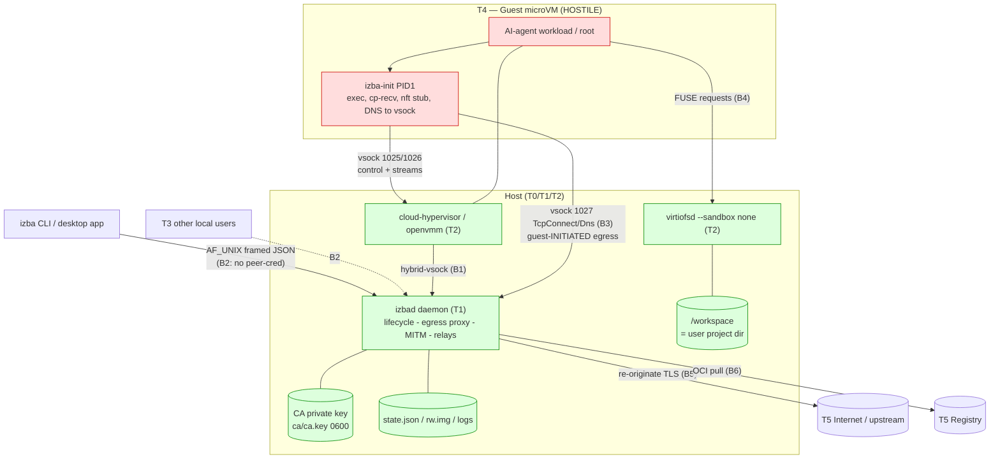

# izba Threat Model

> **Status:** living document. First cut 2026-06-15, covering the M0–M2 +
> desktop-app feature set (microVM lifecycle, daemon-first control plane,
> guest-initiated egress + L7 MITM firewall, OCI→erofs images, cp, port
> publishing). Revisit on every change that adds, moves, or removes a trust
> boundary (see [methodology.md](methodology.md) §"Where security gates slot
> into the pipeline").
>
> This is a **design artifact**, not a findings report. Confirmed/candidate
> weaknesses live in [findings-2026-06-15.md](findings-2026-06-15.md).

## 1. Scope & method

izba is a per-project microVM sandbox manager for AI coding agents — an
independent OSS reimplementation grounded in public prior art (Cloud
Hypervisor, OpenVMM, rust-vmm, virtiofs, containerd erofs, NVIDIA OpenShell),
inspired by the per-project-microVM agent-sandbox model. Its security promise
is the same one Firecracker, gVisor and Kata make: **run hostile code inside a
microVM and keep it off the host.**

This model uses **STRIDE-per-element over a data-flow diagram** for threat
enumeration (the design-phase default), augmented with the microVM-sandbox
domain framing from Firecracker/gVisor/Kata ("the guest is hostile from
instruction zero") and the egress/credential-vault threat surface specific to
izba. Severity is rated with **CVSS v3.1 base + environmental** context and an
exploitability × blast-radius triage. See
[methodology.md](methodology.md) for why this composition was chosen.

## 2. Attacker model & trust levels

The central, load-bearing assumption — inherited from the microVM-sandbox
literature and stated explicitly so every design change is checked against it:

> **A1 — The guest is hostile from the first instruction.** Everything reachable
> from inside the microVM is attacker-controlled input: every byte on the
> vsock planes, every FUSE/virtiofs request, every DNS query, every TLS
> ClientHello and decrypted HTTP request, and `root` inside the VM. The guest
> *will* try to (a) escape to the host, (b) exfiltrate past the egress
> firewall, (c) reach other sandboxes, and (d) steal host secrets (the MITM CA
> key).

| Trust level | Principal | What it can do | Trusted? |
| --- | --- | --- | --- |
| T0 | **Host user** running `izbad` | Everything izba can do | Fully trusted (it *is* the TCB owner) |
| T1 | **izbad daemon** | Sandbox lifecycle, egress proxy, MITM, port relays | Trusted core (the reference monitor) |
| T2 | **VMM + sidecars** (cloud-hypervisor / openvmm / virtiofsd) | Emulate devices, serve `/workspace` | Trusted *but* the primary escape target — see A1 |
| T3 | **Other local users** on a multi-user host | Reach `izbad`'s AF_UNIX socket if perms allow | **Untrusted** |
| T4 | **The guest workload** (the AI agent + anything it runs) | Drive exec/cp, dial egress, parse-attack the host | **Hostile (A1)** |
| T5 | **Remote OCI registry / network** | Serve image manifests + layers, answer DNS, terminate MITM upstream TLS | **Untrusted** |

Secondary assumption, equally load-bearing:

> **A2 — A VMM/virtiofsd compromise must be contained.** Because T2 parses
> T4-controlled bytes, a 0-day in cloud-hypervisor or virtiofsd is *expected*
> over the product's lifetime. The host-side process running the VM is itself
> the last line of defense, so its own confinement (jail/seccomp/namespaces/
> uid-drop) is a security control, not an optimization. izba does **not** meet
> A2 today (see findings F-06/F-07).

## 3. Data-flow diagram (trust boundaries)

## 4. Trust-boundary inventory

The boundaries (Bn) where untrusted bytes cross into more-privileged code —
the elements a serious audit must cover. Ordered by escape value.

| ID | Boundary | Untrusted input | Why it matters |
| --- | --- | --- | --- |
| **B-VIRTIO** | T4 guest → T2 VMM device emulation (virtio block/net/vsock/fs) | Descriptor chains, iovec counts/sizes/offsets | The classic guest→host escape; repeatedly exploited class (QEMU virtio-snd 2026, **Cloud Hypervisor virtio-block UAF CVE-2026-45782**). A bug here lands as the *unjailed* host user (A2 unmet). |
| **B4** | T4 guest → T2 virtiofsd (FUSE) | Crafted paths, `..`, symlink targets, TOCTOU | virtiofs path-escape to the host FS (cf. **Kata CVE-2026-47243**, host-root via `FUSE_SYMLINK`). Run with `--sandbox none` → no second containment layer (F-07). |
| **B3** | T4 guest → T1 izbad egress plane (vsock 1027) | `StreamOpen::{TcpConnect,Dns}` frames, then TLS/HTTP | The *live* hostile-guest→host boundary. izbad is an outbound proxy the guest drives → SSRF, policy bypass, DNS exfil (F-01..F-05). |
| **B5** | T1 izbad MITM → T5 upstream | Guest-chosen SNI / Host / OrigDst IP | L7 allow-list is only as strong as SNI/Host reconciliation + per-request re-check (F-02, F-03). |
| **B-IMG** | T5 registry → T1 host image parser (OCI tar → erofs) | Malicious layer tars | Path traversal, symlink escape, decompression bombs, special files (cf. **node-tar CVE-2026-31802**, **Boxlite CVE-2026-46703 CVSS 10**). |
| **B-CP** | T4 guest → T0 host FS via `izba cp NAME:/src host_dst` | Guest-built tar unpacked on the host | Symlink/`..` escape writing onto the host FS. Host-side unpack lacks the guest-side's openat2 hardening (F-08). |
| **B2** | T3 local user → T1 izbad control socket | Framed `DaemonRequest` | Full sandbox authority (create/exec/splice/publish/shutdown) with **no peer-cred check** — only 0700 dir perms (F-09). |
| **B1** | T4 guest → T1 host (hybrid-vsock CONNECT replies) | `Response`/`StreamOpen` JSON frames | Where the host *starts trusting* guest-authored frames; feeds the serde/codec surface (F-10). |
| **B6** | T5 registry → T1 image identity | Manifest/digest | No signature/provenance (cosign/notation); anonymous-only auth (F-11). |

## 5. Asset register

| Asset | Where | Compromise impact |
| --- | --- | --- |
| **Host FS + host user account** | outside the VM | The product's entire value. Arbitrary host write/read = total loss. (B-VIRTIO, B4, B-CP, B6) |
| **MITM CA private key** | `<root>/ca/ca.key` (0600) | Forges trusted leaves for *every* host every sandbox trusts; unrevocable (no CRL/OCSP). Defeats the firewall. |
| **Egress allow-list decision integrity** | izbad policy/MITM | The firewall's whole promise: a denied destination stays unreachable. (F-01..F-05) |
| **izbad control socket** | `<data>/daemon/izbad.sock` | Full lifecycle authority → exec into any sandbox, publish host ports. (B2) |
| **Host network position** | izbad as outbound proxy | SSRF into loopback / RFC1918 / cloud metadata `169.254.169.254`. (F-01, F-05) |
| **Inter-sandbox isolation** | per-sandbox policy keyed on a name string | One trust domain (`build`) inheriting another's (`web`) grants. |
| **Audit log** | `logs/egress-audit.jsonl` (`izba netlog`) | The record of what egress happened; observability, not an integrity control (F-04). |
| **Host availability** | image build, egress accept loop | DoS via decompression bombs / unbounded thread-per-conn (F-12, F-13). |

## 6. STRIDE per boundary (enumeration → findings)

Threats that survived the first pass map to entries in the findings register.

- **Spoofing** — T3 spoofing a legitimate CLI client over B2 (no peer-cred →
  F-09). Guest spoofing an allow-listed destination via SNI≠Host over B5 (F-02)
  or via DNS-snoop poisoning over B3 (F-05).
- **Tampering** — Guest tampering with the host FS via B-CP symlink escape
  (F-08) or B4 virtiofs escape (F-07). Local user tampering with `state.json`
  to repoint `workspace`/`image` (F-14, gated by the umask finding F-15).
- **Repudiation** — Audit log is best-effort, lossy, un-chained; only the first
  request per kept-alive MITM connection is logged → a hostile guest's traffic
  is systematically under-reported (F-03/F-04).
- **Information disclosure** — CA key readable by any same-user process (F-16).
  Default-umask sandbox dirs leak layout/console logs on multi-user hosts
  (F-15). DNS forwarder is a covert exfil channel (QNAME encoding) (F-05).
- **Denial of service** — 16 MiB-per-frame alloc on a length prefix (F-12);
  unbounded thread-per-connection on B3 (F-13); decompression bombs / huge
  file counts in image flatten (F-17); guest zombie-PID exhaustion (F-18).
- **Elevation of privilege** — The headline: guest→host via B-VIRTIO/B4/B-CP
  with an **unjailed** VMM/virtiofsd amplifying any escape to full host-user
  privilege (F-06/F-07). Guest-supplied uid/gid applied verbatim in exec
  (intended; trusted-path caveat, F-19).

## 7. Security properties the design must uphold (invariants)

These are the testable assertions a spec-first/TDD pipeline should encode as
**abuse-case tests** (see methodology §"Abuse cases as required tests"). A
violated invariant is a failing test, not a judgment call.

1. **No host-FS write outside `/workspace` from any guest action** (cp,
   virtiofs, image). Today: not enforced on the host-side cp path (F-08) and
   only `--shared-dir`-bound on virtiofs (F-07).
2. **Egress fails closed.** An *enforcing* sandbox with the firewall
   unavailable denies, never downgrades. Today: **holds** for the MITM tier
   (router.rs:96-124, well-tested) — a genuine strength.
3. **No SSRF to private/loopback/link-local/metadata** from the egress proxy.
   Today: guarded only on tier-2; absent on the tier-1 MITM dial and the
   AllowAll path (F-01, F-05).
4. **The allow-list is domain *and* port** and re-checked per request. Today:
   domain-only, first-request-only (F-02, F-03).
5. **The CA private key never leaves the host and never enters a guest.**
   Today: **holds** (only `ca.pem` is shared, read-only) — a strength;
   residual same-user-process exposure (F-16).
6. **Control-plane authority requires authenticating the caller.** Today: only
   filesystem perms (F-09).
7. **A VMM/virtiofsd compromise is contained below host-user privilege** (A2).
   Today: **not met** (F-06/F-07).
8. **All untrusted parsers are bounded** (frame size, file count, recursion,
   total bytes). Today: partial (16 MiB frame cap exists but is per-frame, not
   per-peer; no image size caps) (F-12, F-17).

## 8. Out of scope / accepted risks (record explicitly)

- **Guest-local privilege escalation / in-guest namespace weakness** (chroot
  only, no mount/pid/net namespace; guest-supplied uid/gid). Contained by the
  VM boundary (A1) — *acceptable by design*, but it weakens any future
  per-role/credential-vault model layered inside one guest (F-19, F-20).
- **DNS-snoop as an authorization boundary** — it is a cooperative
  observability tier, evadable by rebinding/direct-IP/DoH. Treated as a
  heuristic, never a control (must stay documented, not relied upon) (F-05).
- **The in-guest nft/dummy0 "structural deny"** — a hostile guest root can
  flush nft and talk AF_VSOCK 1027 directly. Enforcement that matters is 100%
  on the izbad side; the guest-side stub only shapes well-behaved traffic
  (F-21). Any reasoning that treats nft/dummy0 as containment is misplaced.
- **Side channels** (Spectre-class, timing) across the VM boundary — inherited
  from the CPU/KVM/WHP layer; out of scope for the application audit.

## 9. References

- Firecracker design & threat model — <https://github.com/firecracker-microvm/firecracker/blob/main/docs/design.md>
- gVisor security model — <https://gvisor.dev/docs/architecture_guide/security/>
- Kata Containers threat model — <https://github.com/kata-containers/kata-containers/blob/main/docs/threat-model/threat-model.md>
- Microsoft STRIDE / Threat Modeling — <https://learn.microsoft.com/en-us/azure/security/develop/threat-modeling-tool-threats>
- [docs/design-lineage.md](../design-lineage.md) — how each izba subsystem maps to its OSS building blocks.
- [docs/superpowers/specs/2026-06-12-izba-mesh-networking-design.md](../superpowers/specs/2026-06-12-izba-mesh-networking-design.md) — the multi-sandbox mesh / policy-hub direction this model must keep auditable.
